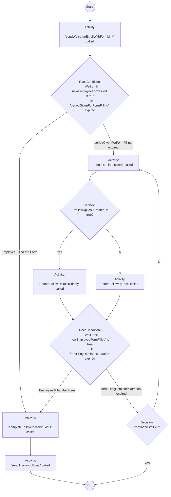
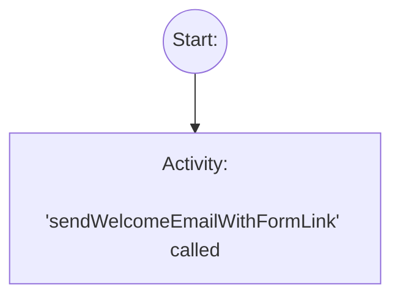
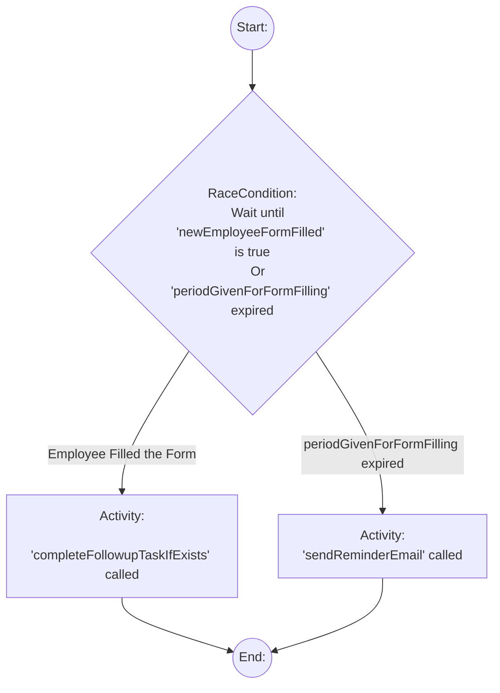
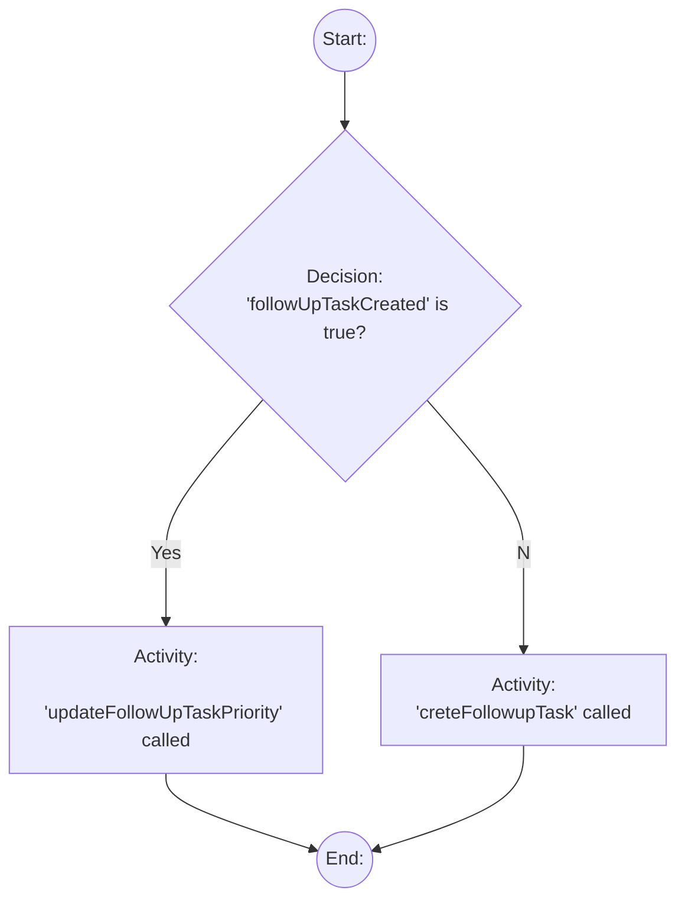

# This document summarize how we are using Temporal workflows in our application

## Workflow Method

Workflow method is a method that defines a Temporal workflow using Typescript SDK. Below are instructions in how we create workflow methods.

### Defining a Workflow Method

A workflow is defined using a async method as shown below. 

```ts
export async function SampleWorkflow(initialState: SampleWorkflowState): Promise<SampleWorkflowState> {
    // Workflow logic goes here
}
```
As you can see our workflow is called `SampleWorkflow` and it takes in an `initialState` of type `SampleWorkflowState`. The concept is that any given workflow will have it's own state and we will pass the initial state as a parameter for the method that defines the workflow (like shown in the above example)

It's the job of the Workflow method to use the initial state to execute the workflow defined within the method. While executing the workflow, the workflow method will update the initialState based on the results of it's workflow execution and finally return the updated workflow state as a result.

### Workflow State

The Workflow State will contain all the information relevant for the workflow to run and also will hold the state of variables that are impacted by the workflow execution. Basically Workflow state defines the context in which the workflow is executed.

```ts
// below is an example of a workflow state type 
type SampleWorkflowState {
  employee: NewEmployeeNotJoined;
  welcomeEmailSent: boolean;
  periodGivenToFillTheForm: string | number;
  numberOfRemindersForFormFilling: number;
  durationBetweenFormFillingReminders: string | number;
  newEmployeeFormFilled: boolean;
  followUpTaskCreated: boolean;
  followUpTask: HRFollowUpTask | undefined;
}
```

It's important to understand that workflow state is NOT application state. Application state can be managed by the application that is calling the workflow and workflow state can be a subset of the application state. However, A workflow is not responsible for application state, it's only responsible for Workflow State

A workflow method will receive the workflow state as it's parameter and this initial workflow state is called the `initialState`. Workflow method will use it's state to obtain the context it requires to execute the workflow. As it executes the workflow workflow method will update the workflow state and finally will return the updated and finalized workflow state as the result of workflow execution.

### Workflow Execution

There are two very important rules when executing the workflow within the workflow methods.
1. Workflow state can ONLY be mutated within Temporal Signal handler or by calling a Temporal Activity. 
2. Workflow state can be queried by Temporal Queries

Based on the above two rules and what we discussed so far, We can define a structure for any Workflow method we write. Below example show a typical structure of a workflow method.

1. Create a workflow state using initialState
```ts
export async function SampleWorkflow(initialState: SampleWorkflowState): Promise<SampleWorkflowState> {
    // Create a workflowState by copying the initial state 
    let workflowState = {...initialState}
    // TODO: Rest of the workflow code...
}
```
This is a very important step to ensure immutability of workflow state. We ensure that we `copy` the initial state and work on that.

2. Destruct workflow state to obtain "static context variables" that are required to execute the workflow. Static Context Variable are workflow state variables that will not get mutated during the execution of the workflow (hence static), We will assign default values also to ensure workflow will execute based on some predetermined context if needed.

Below is an Example that shows how we destruct and default static context variables from the workflow state.

```ts
export async function SampleWorkflow(initialState: SampleWorkflowState): Promise<SampleWorkflowState> {
    // existing code for previous steps...

    // Destruct and default the static context variables from Workflow State
    const {
    periodGivenToFillTheForm = '90 seconds',
    numberOfRemindersForFormFilling = 3,
    durationBetweenFormFillingReminders = '20 seconds',
  } = workflowState
  
  // TODO: Rest of the workflow code...
}
```

3. Define Handlers for Temporal Signals and Queries that are already defined. As mentioned above, we use Temporal Signals to mutate the workflow state and Temporal queries to allow external clients query the workflow state. During this step we ensure that we define handlers for both.

Below is an example that shows how we destruct the already defied `signals` and `queries` objects to create handlers. Note that we assume all relevant signals and queries are already defined under `signals` and `queries` object outside the main workflow method. 

```ts
export async function SampleWorkflow(initialState: SampleWorkflowState): Promise<SampleWorkflowState> {
  // existing code for previous steps...

  // Destruct and create handlers for signals and queries required in our workflow method
  const { filledNewEmpForm } = signals
  const { getWorkflowState } = queries
  wf.setHandler(filledNewEmpForm, () => void(workflowState.newEmployeeFormFilled = true))
  wf.setHandler(getWorkflowState, ()=>workflowState)    
  
  // TODO: Rest of the workflow code...
}
```
Note in the example we are mutating the workflow state variable `newEmployeeFormFilled`. 

4. Next we can destruct all the activities that we will be using within the workflow.  

```ts
export async function SampleWorkflow(initialState: SampleWorkflowState): Promise<SampleWorkflowState> {
  // existing code for previous steps...
  // Destruct the act object we defined when importing all the activities.
  const {sendWelcomeEmail,sendThankyouEmail, sendReminderEmail, creteFollowupTask, updateFollowUpTask: updateFollowUpTask, completeFollowupTask: completeFollowupTask} = act;
     
  // TODO: Rest of the workflow code...
}
```
Now we have completed all the steps required to start work on the workflow. Let's look at the workflow method we completed so far.

```ts
export async function SampleWorkflow(initialState: SampleWorkflowState): Promise<SampleWorkflowState> {
  // Create a workflowState by copying the initial state 
  let workflowState = {...initialState}
  
  // Destruct and default the static context variables from Workflow State
  const {
    periodGivenToFillTheForm = '90 seconds',
    numberOfRemindersForFormFilling = 3,
    durationBetweenFormFillingReminders = '20 seconds',
  } = workflowState

  // Destruct and create handlers for signals and queries required in our workflow method
  const { filledNewEmpForm } = signals
  const { getWorkflowState } = queries
  wf.setHandler(filledNewEmpForm, () => void(workflowState.newEmployeeFormFilled = true))
  wf.setHandler(getWorkflowState, ()=>workflowState)

  // Destruct the act object we defined when importing all the activities.
  const {sendWelcomeEmail,sendThankyouEmail, sendReminderEmail, creteFollowupTask, updateFollowUpTask: updateFollowUpTask, completeFollowupTask: completeFollowupTask} = act

  // TODO: Workflow Logic goes here.

  // Finally return the finalized and updated workflow state
  return workflowState
}
```

### Coding Workflow Logic

Typically we will depict the workflow using a Mermaid graph like shown below. We will see step by step, how we are going to code each aspect of this graph


You can see each node in the graph has a `category name` and it's shown before the `:` character of the description. In the above example graph, we have the following categories.

1. Start
2. End
3. Activity
4. RaceCondition
5. Decision

We will have a standard coding patterns to code each of these categories in our workflows. Given the fact that most of, if not all workflows area a combination of the 5 categories given above, we should be able to standardize coding pattern of any given workflow.

### Coding Patterns for 5 Workflow Node Categories

#### Start Node category

A Start node is denoted by the following pattern in the mermaid graph:

`<Letter>((Start:))`

In the above mermaid workflow, start node is depicted as `A((Start:))`. There can be a maximum of 1 start node in a workflow.

Start node doesn't have any typescript code representation since it symbolizes the start of the workflow.

#### End Node Category

A End node is denoted by the following pattern in the mermaid graph:

`<Letter>((End:))`

In the above mermaid workflow, end node is depicted as `G((End:))`. There can be a maximum of 1 end node in a workflow.

End node is typically represented by typescript code by return statement of the workflow method. Below code snippet shows how to represent the End node in a typical workflow method.

```ts
export async function SampleWorkflow(initialState: SampleWorkflowState): Promise<SampleWorkflowState> {
  // workflow setup code 

  // TODO: Workflow Logic goes here.

  // End node is represented by returning the updated and finalized workflow State as shown below
  return workflowState
}
```

#### Activity Node Category

A Activity node is denoted by the following pattern in the mermaid graph:

`<Letter>["Activity: 'activityMethodName' called"]`

There can be any number of activity nodes in a given workflow. In the above mermaid workflow example we have few activities defined. For Instance, 


This shows that we need to call Activity `sendWelcomeEmailWithFormLink` right after starting the workflow.

Activity node is typically represented by typescript code by making a call to the activity. Below code snippet shows how to represent the End node in a typical workflow method.

```ts
export async function SampleWorkflow(initialState: SampleWorkflowState): Promise<SampleWorkflowState> {
  // Create a workflowState by copying the initial state 
  let workflowState = {...initialState}
  
  // workflow setup code 
  const { sendWelcomeEmailWithFormLink } = act

  //Workflow code
  
  // Example shown above, B["Activity:'sendWelcomeEmailWithFormLink' called"] is represented by calling the activity method
  workflowState = await sendWelcomeEmailWithFormLink(workflowState)
  
  // TODO: rest of the workflow
}
```

#### RaceCondition Node Category

A RaceCondition node is denoted by the following pattern in the mermaid graph:

```
<Letter>{"RaceCondition:
    Wait until '<name of the workflow state variable>' is true
    Or '<duration or time period variable defined in workflow state>' expired"}
```

There can be any number of RaceCondition nodes in a given workflow. Below is an example of how we will represent a RaceCondition node in Mermaid.


This shows that we need to wait until either `newEmployeeFormFilled` state variable becomes true, or till the duration defined in workflow state variable `periodGivenForFormFilling` is expired. Based on which action happens first, workflow path will be determined. 

As you can see a race condition has two possible outcome execution paths. and we need to handle both. In the example given, if the employee filled the form (i.e. when `newEmployeeFormFilled` state variable becomes true) before the `periodGivenForFormFilling` is expired, then activity `completeFollowupTaskIfExists` will be called. If the employee doesn't fill the form and time duration `periodGivenForFormFilling` is expired, then activity `sendReminderEmail` will be called. 

RaceCondition node is a very important node and we will see how to represent them in typescript using the above simple mermaid graph example.

```ts
export async function SampleWorkflow(initialState: SampleWorkflowState): Promise<SampleWorkflowState> {
  // Assume we have newEmployeeFormFilled, periodGivenForFormFilling are all setup in the code already

  // Assume we have completeFollowupTaskIfExists and sendReminderEmail activities are also setup 
  
  // below code shows an example of how to represent a RaceCondition in typescript
  const [formFilled, periodGivenForFormFillingExpired] = await until(workflowState.newEmployeeFormFilled).orTimeout(periodGivenForFormFilling)
  if(formFilled) {
    workflowState = await completeFollowupTask(workflowState)
  } else if(periodGivenForFormFillingExpired) {
    workflowState = await sendReminderEmail(workflowState)
  }
  return workflowState;
}
```

#### Decision Node Category

A Decision node is denoted by the following pattern in the mermaid graph:

```
<Letter>{"Decision:
    '<name of the workflow state variable>' is true?"}

```

There can be any number of Decision nodes in a given workflow. Below is an example of how we will represent a Decision node in Mermaid.


Above graph shows that we are checking if `followUpTaskCreated` workflow state variable is true. If it's true, we call activity `updateFollowUpTaskPriority`, otherwise, we call activity `creteFollowupTask`. 

There is no waiting involved in a Decision node, you simply chose an execution path based on a workflow state variable value.

Decision node is a very important node and we will see how to represent them in typescript using the above simple mermaid graph example.

```ts
export async function SampleWorkflow(initialState: SampleWorkflowState): Promise<SampleWorkflowState> {
  // Assume we have followUpTaskCreated workflow state variable already setup

  // Assume we have updateFollowUpTaskPriority and creteFollowupTask activities are also setup 
  
  // below code shows an example of how to represent a Condition node in typescript
  if(workflowState.followUpTaskCreated) {
    workflowState = await updateFollowUpTaskPriority(workflowState)
  } else if(periodGivenForFormFillingExpired) {
    workflowState = await creteFollowupTask(workflowState)
  }
  return workflowState;
}
```