# This document summarize how We can Convert a Mermaid Workflow Diagram into Temporal TypeScript SDK Code

## Coding Workflow Logic

Typically we will depict any workflow using a Mermaid graph like shown below. 

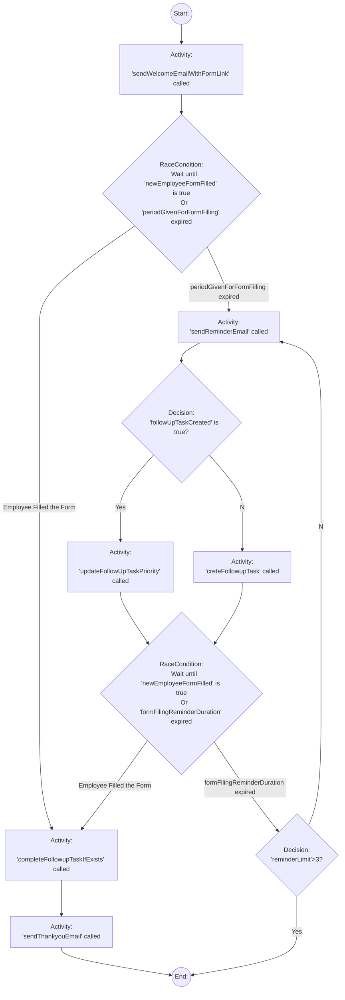
Any given Mermaid graph would contain 5 Workflow Node Categories. We represent a Category in a Mermaid graph by giving the `category name` followed by a `:`.

Below are the 5 Node Categories, and their representation in a Mermaid graph

1. `Start` Node Category

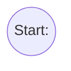
2. `End` Node Category

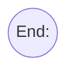

3. `Activity` Node Category

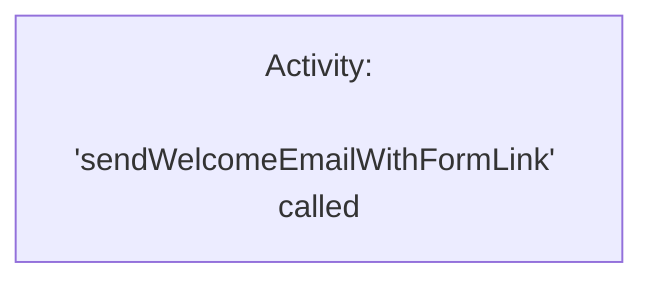

4. `RaceCondition` Node Category

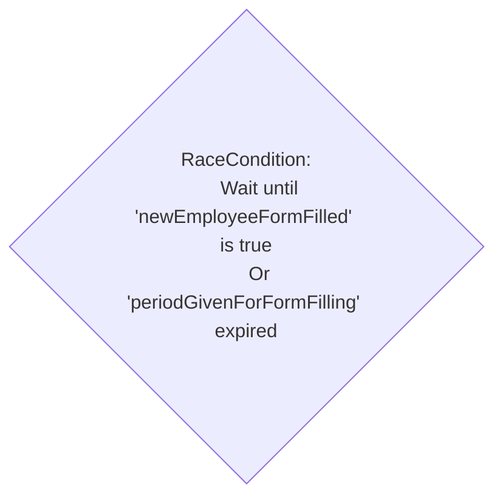

5. `Decision` Node Category

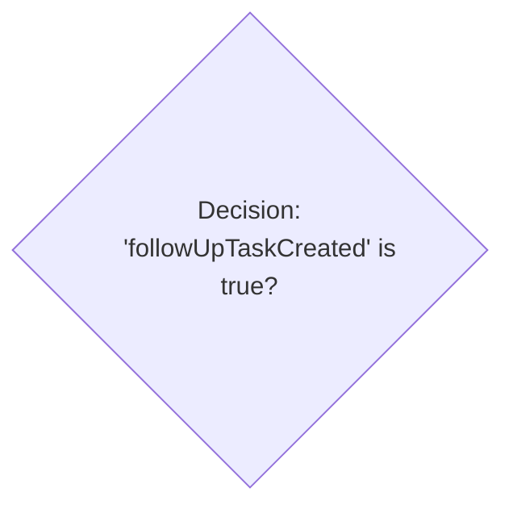

Given the fact that most of, if not all workflows area a combination of the 5 categories given above, we should be able Create any workflow using those categories.

## Coding 5 Workflow Node Categories in TypeScript

### Start Node category

A Start node is denoted by the following pattern in the mermaid graph:

`<Letter>((Start:))`

In the above mermaid workflow, start node is depicted as `A((Start:))`. There can be a maximum of 1 start node in a workflow.

Start node doesn't have any typescript code representation since it symbolizes the start of the workflow.

### End Node Category

A End node is denoted by the following pattern in the mermaid graph:

`<Letter>((End:))`

There can be a maximum of 1 end node in a workflow.

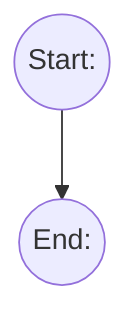

End node is typically represented by typescript code by return statement of the workflow state. Below code snippet shows how to represent the End node in a typical workflow method.

```ts
  return workflowState
```

### Activity Node Category

A Activity node is denoted by the following pattern in the mermaid graph:

`<Letter>["Activity: 'activityMethodName' called"]`

There can be any number of activity nodes in a given workflow. In the above mermaid workflow example we have few activities defined. For Instance, 

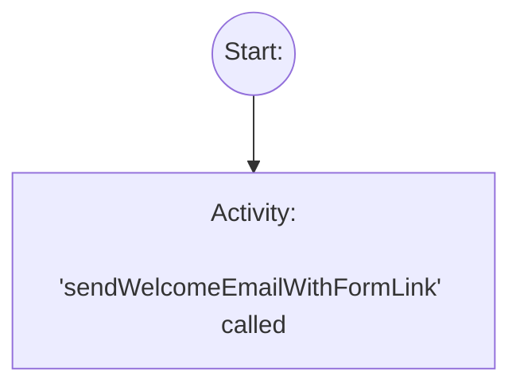
This shows that we need to call Activity `sendWelcomeEmailWithFormLink` right after starting the workflow.

Activity node is typically represented by typescript code by making a call to the activity. Below code snippet shows how to represent the End node in a typical workflow method.

```ts
  workflowState = await sendWelcomeEmailWithFormLink(workflowState)
```

### RaceCondition Node Category

A RaceCondition node is denoted by the following pattern in the mermaid graph:

```
<Letter>{"RaceCondition:
    Wait until '<name of the workflow state variable>' is true
    Or '<duration or time period variable defined in workflow state>' expired"}
```

There can be any number of RaceCondition nodes in a given workflow. Below is an example of how we will represent a RaceCondition node in Mermaid.

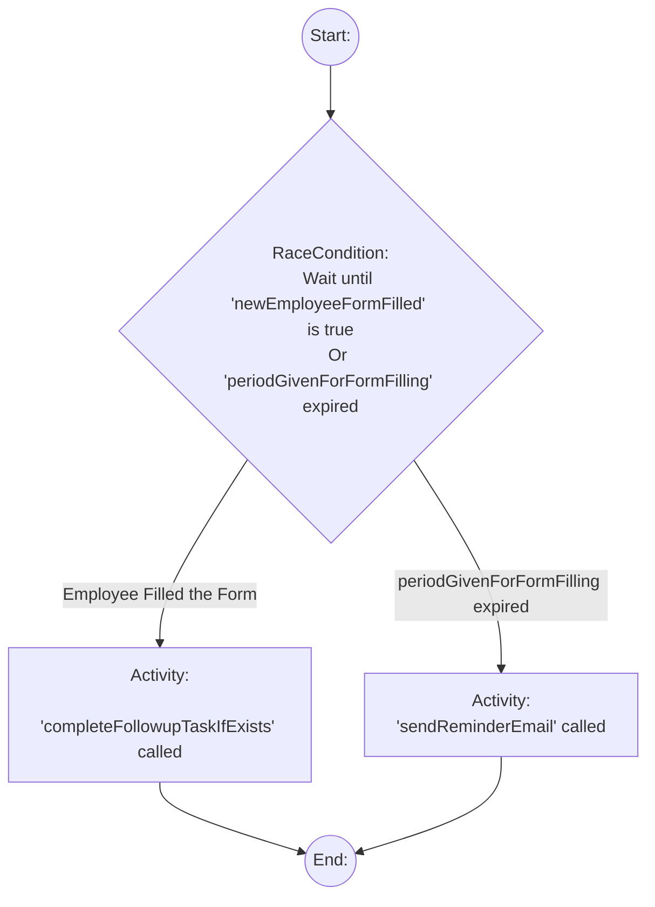
`newEmployeeFormFilled` and `periodGivenForFormFilling` are workflow state variables. And `completeFollowupTaskIfExists`, `sendReminderEmail` are Activities. 

RaceCondition node is converted to typescript using `untilSatisfied(condition: boolean, timeout: string | number | undefined)` method. if the `condition` becomes true, then untilSatisfied() will return `[true, false]`. If timeout, it will return `[false, true]`

Below typescript snippet shows how the RaceCondition node shown in the above Mermaid graph converted to typescript

```ts
  const [formFilled, periodGivenForFormFillingExpired] = await untilSatisfied(workflowState.newEmployeeFormFilled, periodGivenForFormFilling)
  if(formFilled) {
    workflowState = await completeFollowupTask(workflowState)
  } else if(periodGivenForFormFillingExpired) {
    workflowState = await sendReminderEmail(workflowState)
  }
```

### Decision Node Category

A Decision node is denoted by the following pattern in the mermaid graph:

```
<Letter>{"Decision:
    '<name of the workflow state variable>' is true?"}

```

There can be any number of Decision nodes in a given workflow. Below is an example of how we will represent a Decision node in Mermaid.

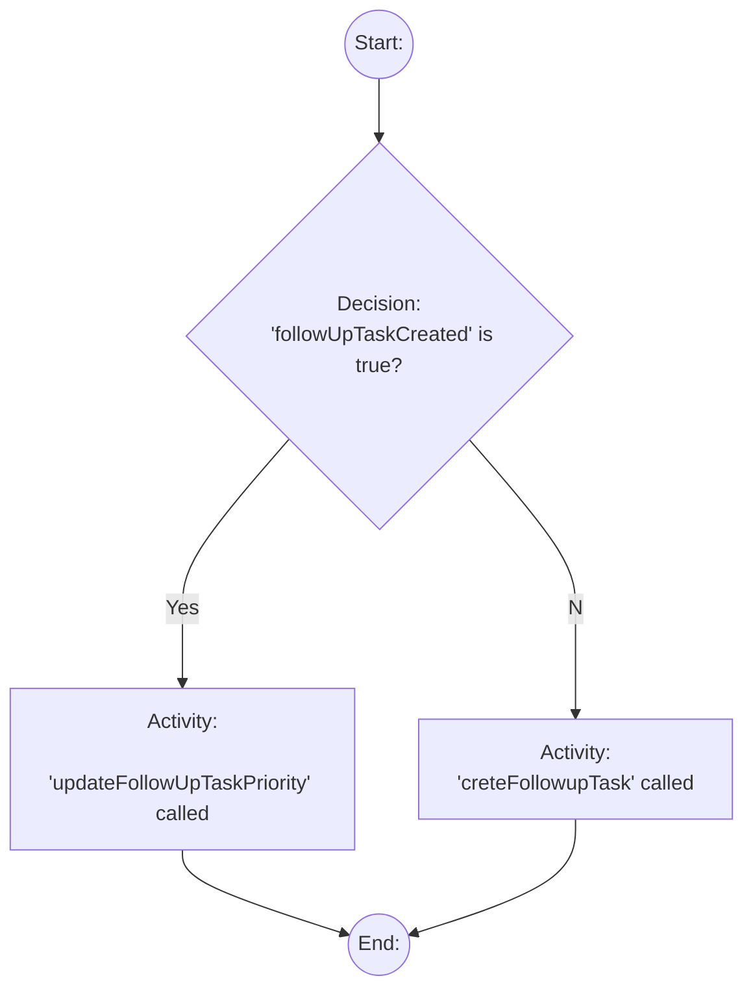
`followUpTaskCreated` is a workflow state variable. `updateFollowUpTaskPriority` and `creteFollowupTask` are Activities. There is no waiting involved in a Decision node, you simply chose an execution path based on a workflow state variable value.

Below typescript snippet shows how the Decision node shown in the above Mermaid graph converted to typescript

```ts
  if(workflowState.followUpTaskCreated) {
    workflowState = await updateFollowUpTaskPriority(workflowState)
  } else {
    workflowState = await creteFollowupTask(workflowState)
  }
```
### How to represent Loops in Workflows in Typescript

Consider the following Mermaid Diagram
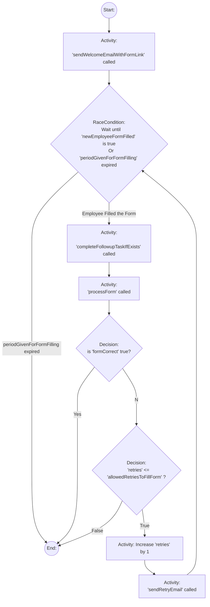
Here, we want to allow retries in case some one fill the form incorrectly. The Decision node `G` checks if the form is correct or not. If Not, It will check if the number of allowed retries are are exceeded, if not, it will send a retry email and loop back to RaceCondition node `C`. 

This is a common practice in many workflows where we need to loop back to previous node. Below typescript code shows one way to implement the Loop required here.

A `loop` is indicated by any node that has an outgoing path(arrow) and and an incoming path(arrow). We can see in the above graph Node `C` has both outgoing and Incoming arrows which indicate we need to begin a loop.

```ts
// ... Existing workflow logic
let retries = 0;
workflowState = await sendWelcomeEmailWithFormLink(workflowState)
do {
  const [formFilled, periodGivenForFormFillingExpired] = await untilSatisfied(workflowState.newEmployeeFormFilled, periodGivenForFormFilling)
  if(formFilled) {
    workflowState = await processForm(workflowState)
    if(workflowState.formCorrect) {
      break;
    } 
  } else if(periodGivenForFormFillingExpired) {
    break;
  }
  // code will come here if workflowState.formCorrect === false
  retries++
  workflowState = await sendRetryEmail(workflowState);
} while(retries <= workflowState.allowedRetriesToFillForm)
// End: node
return workflowState

```